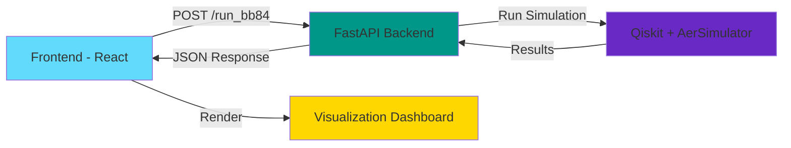

# BB84 Quantum Key Distribution Simulator

A full-stack web application that simulates the BB84 Quantum Key Distribution (QKD) protocol using Qiskit for quantum simulation and React for visualization.

## 🎯 Overview

This application provides an interactive simulation of the BB84 protocol, the first quantum cryptography protocol developed by Charles Bennett and Gilles Brassard in 1984. Users can visualize quantum states, bases, measurement outcomes, and analyze the security through Quantum Bit Error Rate (QBER).

## 🏗️ Architecture



## 🚀 Features

- **Interactive Simulation**: Configure qubit count, noise level, and random seed
- **Quantum Circuit Visualization**: View quantum circuits for each transmission round
- **Real-time Statistics**: Monitor QBER, key length, and efficiency
- **Basis Comparison**: Visualize Alice and Bob's basis choices
- **Key Sifting**: See the final shared key after basis matching
- **Data Export**: Download simulation results as CSV
- **Educational**: Built-in explanations of BB84 protocol concepts

## 🛠️ Technology Stack

### Backend
- **FastAPI**: Modern Python web framework
- **Qiskit**: IBM's quantum computing framework
- **Qiskit Aer**: High-performance quantum circuit simulator
- **Numpy**: Numerical computing
- **Matplotlib**: Circuit visualization

### Frontend
- **React**: UI framework
- **Vite**: Build tool and dev server
- **Tailwind CSS**: Utility-first CSS framework
- **Axios**: HTTP client
- **Chart.js**: Data visualization
- **React-ChartJS-2**: React wrapper for Chart.js

## 📦 Installation

### Prerequisites
- Python 3.8+
- Node.js 16+
- npm or yarn

### Backend Setup

1. Navigate to the backend directory:
```bash
cd backend
```

2. Create a virtual environment (recommended):
```bash
python -m venv venv
source venv/bin/activate  # On Windows: venv\Scripts\activate
```

3. Install dependencies:
```bash
pip install -r requirements.txt
```

4. Run the backend server:
```bash
python main.py
```

The API will be available at `http://localhost:8000`

API documentation (Swagger UI) will be at `http://localhost:8000/docs`

### Frontend Setup

1. Navigate to the frontend directory:
```bash
cd frontend
```

2. Install dependencies:
```bash
npm install
```

3. Run the development server:
```bash
npm run dev
```

The application will be available at `http://localhost:5173`

## 🎮 Usage

1. **Start both servers**: Backend (port 8000) and Frontend (port 5173)

2. **Configure Parameters**:
   - **Number of Qubits**: 1-1000 (default: 50)
   - **Noise Level**: 0.0-1.0 (default: 0.0)
   - **Random Seed**: Optional for reproducibility

3. **Run Simulation**: Click "Run Simulation" button

4. **Explore Results**:
   - View statistics cards (total qubits, sifted key length, efficiency, QBER)
   - Examine basis comparison chart
   - Visualize individual quantum circuits
   - Review bit-basis comparison table
   - Download results as CSV

## 📊 Understanding the Results

### QBER (Quantum Bit Error Rate)
- **< 11%**: Secure - Key can be used safely
- **> 11%**: Insecure - Possible eavesdropping or excessive noise

### Key Efficiency
- Typically ~50% (half the qubits have matching bases)
- Shows the ratio of sifted key length to total qubits transmitted

### Basis Matching
- Green rows: Bases matched, bit kept in final key
- White rows: Bases didn't match, bit discarded

## 🐳 Docker Deployment (Optional)

### Build and run with Docker Compose

1. Create a `docker-compose.yml` file:

```yaml
version: '3.8'

services:
  backend:
    build: ./backend
    ports:
      - "8000:8000"
    environment:
      - PYTHONUNBUFFERED=1

  frontend:
    build: ./frontend
    ports:
      - "5173:5173"
    environment:
      - VITE_API_URL=http://localhost:8000
    depends_on:
      - backend
```

2. Create Dockerfile for backend (`backend/Dockerfile`):

```dockerfile
FROM python:3.11-slim

WORKDIR /app

COPY requirements.txt .
RUN pip install --no-cache-dir -r requirements.txt

COPY main.py .

CMD ["uvicorn", "main:app", "--host", "0.0.0.0", "--port", "8000"]
```

3. Create Dockerfile for frontend (`frontend/Dockerfile`):

```dockerfile
FROM node:18-alpine

WORKDIR /app

COPY package*.json ./
RUN npm install

COPY . .

EXPOSE 5173

CMD ["npm", "run", "dev", "--", "--host"]
```

4. Run:
```bash
docker-compose up --build
```

## 🔌 API Endpoints

### GET /
- Root endpoint with API information

### POST /run_bb84
- Run BB84 simulation
- Body: `{ "n_qubits": 100, "noise_level": 0.0, "seed": null }`
- Returns: Simulation summary

### GET /results
- Get detailed simulation results
- Returns: Alice/Bob bits, bases, measurements, and sifted keys

### GET /stats
- Get simulation statistics
- Returns: QBER, efficiency, error count, etc.

### GET /visualize_round/{round_index}
- Get quantum circuit visualization for specific round
- Returns: Circuit image (base64) and round details

## 🧪 Testing

### Backend Testing
```bash
cd backend
python -m pytest  # If you add tests
```

### Frontend Testing
```bash
cd frontend
npm run test  # If you add tests
```

## 🎓 Educational Resources

### BB84 Protocol Steps:
1. **Preparation**: Alice generates random bits and encodes them in random bases (Z or X)
2. **Transmission**: Qubits are sent through a quantum channel to Bob
3. **Measurement**: Bob measures received qubits in randomly chosen bases
4. **Basis Reconciliation**: Alice and Bob publicly compare bases (not bits)
5. **Key Sifting**: Keep only bits where bases matched
6. **Error Estimation**: Check QBER to detect eavesdropping
7. **Privacy Amplification**: Further processing to ensure security (not implemented here)

### Quantum Bases:
- **Z Basis (Computational)**: |0⟩ and |1⟩ states
- **X Basis (Hadamard)**: |+⟩ and |−⟩ states (superposition)

### Security Principle:
Any eavesdropping attempt disturbs quantum states due to measurement, increasing QBER and alerting legitimate parties.

## 🤝 Contributing

Contributions are welcome! Please feel free to submit a Pull Request.

## 📝 License

This project is open source and available under the [MIT License](LICENSE).

## 🙏 Acknowledgments

- Charles Bennett and Gilles Brassard for the BB84 protocol
- IBM Qiskit team for the quantum computing framework
- React and FastAPI communities

## 📧 Contact

For questions or feedback, please open an issue on GitHub.

---

**Note**: This is a simulation for educational purposes. Real quantum key distribution requires actual quantum hardware and additional security protocols.
